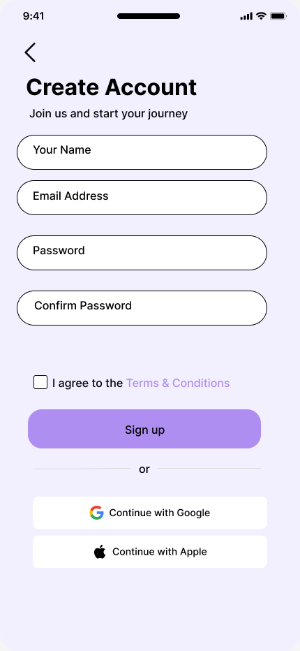
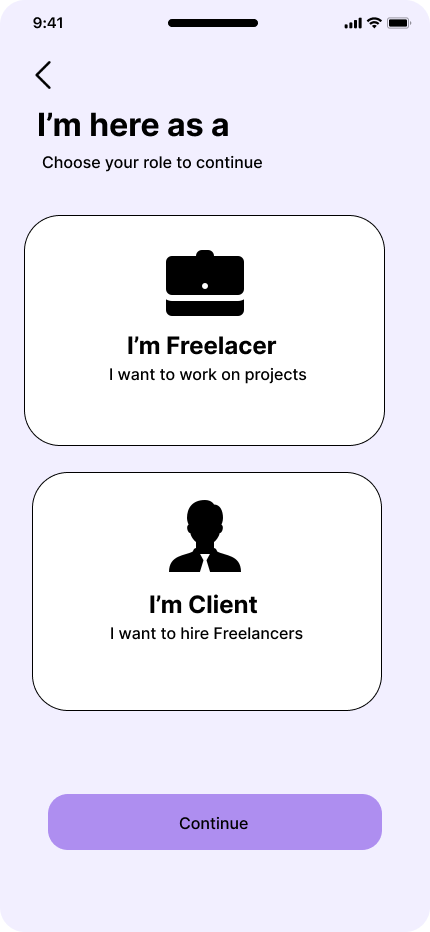
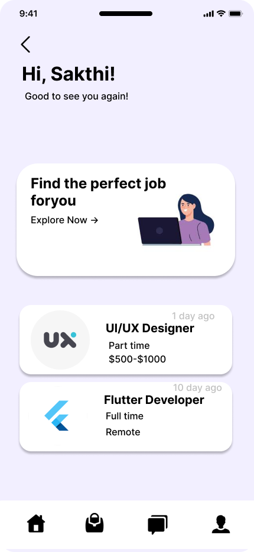
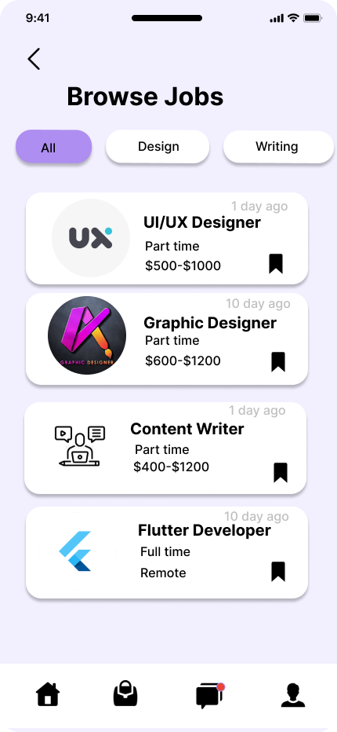

# JobSee - Job Search App UI

## 📱 Overview
JobSee is a modern job search mobile application UI designed in Figma. The project focuses on creating a clean, intuitive, and user-friendly experience for job seekers.

## ✨ Features
- Onboarding Screen
- Sign Up & Login
- Role Selection
- Home Screen
- Browse Jobs
- Job Details
- Messages
- My Jobs
- Notifications
- User Profile

## 📸 UI Screenshots

### Onboarding

### Login

### Sign Up

### Role Selection

### Home

### Browse Jobs

### Job Details

### Messages

### Notifications

### Profile

## 🎨 Design Tool
- Figma

## 🎯 Objective
To design a modern, visually appealing, and user-friendly job search application that improves the user experience for finding and applying to jobs.

## 👩‍💻 Designed By
**Lakshmidevi M**
